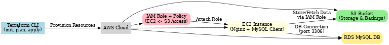
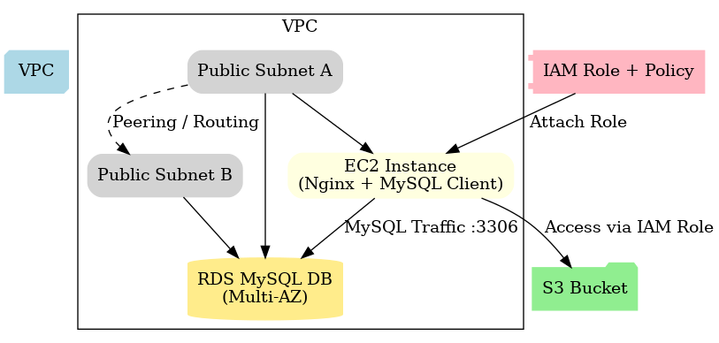

# Infrastructure as Code with Terraform + AWS

This project provisions a **complete cloud infrastructure** on AWS using **Terraform**.
It demonstrates how to manage **compute, storage, security, and database** resources as code, making it reusable, version-controlled, and automated.

---

## 🚀 Tools & Technologies

* **Terraform** – Infrastructure as Code
* **AWS** – Cloud provider

  * **EC2** – Virtual servers
  * **S3** – Object storage
  * **IAM** – Identity & access management
  * **RDS (MySQL)** – Managed relational database
* **Amazon Linux / Ubuntu** – Base OS for EC2
* **Nginx** – Simple web server for demo

---

## 🏗️ Infrastructure Overview

1. **Networking**

   * Custom VPC with subnets and internet gateway
2. **Compute**

   * EC2 instance (t2.micro / t3.micro)
   * User-data script installs **Nginx**
3. **Storage**

   * S3 bucket for storing files
   * IAM user with restricted access (policy only allows this bucket)
4. **Database**

   * RDS MySQL instance
   * Accessible only from EC2 inside the same VPC

---

## 📂 Repo Structure

```
02-terraform-aws/
│── main.tf                               # VPC, Subnets, EC2, Security Groups
│── variables.tf                          # Input variables
│── terraform.tfvars                      # Variable values (user-provided)
│── outputs.tf                            # Useful outputs
│── s3.tf                                 # S3 bucket config
│── iam.tf                                # IAM user + policy for S3 access
│── rds.tf                                # RDS instance (MySQL) + subnet group + SG
│── provider.tf                           # AWS provider configuration
│── README.md                             # Project documentation
│── docs/
│   ├── S3.md                             # Explains s3.tf
│   ├── IAM.md                            # Explains iam.tf
│   ├── RDS.md                            # Explains rds.tf
├── diagrams/                             
│   ├── terraform_aws_workflow.png        # Workflow diagram
│   ├── terraform_aws_architecture.png    # Architecture diagram 
│   └── README.md                         # Diagrams documentation
└── README.md                             # Project documentation
```

---

## ⚙️ Setup Instructions

### 1. Clone the repo

```bash
git clone https://github.com/<your-username>/02-terraform-aws.git
cd 02-terraform-aws
```

### 2. Configure AWS credentials

```bash
aws configure
```

* Provide your AWS Access Key, Secret Key, region (e.g., `ap-south-1`).

### 3. Initialize Terraform

```bash
terraform init
```

### 4. Format & Validate

```bash
terraform fmt
terraform validate
```

### 5. Plan & Apply

```bash
terraform plan -var-file="terraform.tfvars"
terraform apply -var-file="terraform.tfvars"
```

---

## 🔑 Variables (`terraform.tfvars` example)

```hcl
project_name = "tf-demo"
aws_region   = "ap-south-1"

# EC2
instance_type = "t3.micro"

# RDS
db_password = "MySecurePass123!"

# Tags
tags = {
  Environment = "Dev"
  Project     = "Terraform-AWS"
}
```

---

## 📊 Outputs

After apply, Terraform prints:

* **EC2 Public IP** → Access Nginx in browser
* **S3 Bucket Name** → Upload/download objects
* **IAM User** → Programmatic access restricted to this bucket
* **RDS Endpoint** → Connect from EC2 using MySQL client

---

## 🔍 Verification

### 1. Test EC2 + Nginx

Get EC2 public IP:

```bash
terraform output -raw ec2_public_ip
```

Visit in browser:
`http://<EC2_PUBLIC_IP>`

---

### 2. Test S3 + IAM

Configure new AWS profile with Terraform output access keys:

```bash
aws configure --profile s3demo
```

Upload a file:

```bash
echo "Hello from IAM user" > test.txt
aws s3 cp test.txt s3://$(terraform output -raw s3_bucket_name)/ --profile s3demo
```

---

### 3. Test RDS

From EC2 instance:

```bash
mysql -h $(terraform output -raw rds_endpoint) -u admin -p
```

Inside MySQL:

```sql
SHOW DATABASES;
```

---

## 🧹 Cleanup

Destroy all resources to avoid charges:

```bash
terraform destroy -var-file="terraform.tfvars"
```

---

## 📊 Project Diagrams

To better understand how the infrastructure is provisioned and connected, here are the key diagrams:

### Workflow Diagram
Shows how Terraform provisions AWS resources and how they interact.



### Architecture Diagram
High-level AWS architecture including VPC, subnets, EC2, RDS, S3, and IAM role.



---

## 📌 Key Learnings

* Infrastructure as Code ensures **consistency, reproducibility, and automation**.
* IAM enables **least privilege** security practices.
* Combining **EC2 + RDS + S3 + IAM** covers the foundation of most real-world AWS projects.

