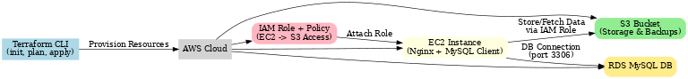

# Infrastructure as Code (Terraform + AWS) – Workflow Diagram

This diagram shows how Terraform provisions and connects AWS resources in this project.

**Workflow:**
1. Terraform CLI provisions resources into AWS.
2. EC2 instance is created (running Nginx + MySQL client).
3. S3 bucket is provisioned for storage/backups.
4. IAM role + policy grants EC2 secure access to S3.
5. RDS MySQL database is provisioned and accessible from EC2.
6. EC2 connects to RDS (port 3306) and interacts with S3 using IAM role permissions.

# Infrastructure as Code (Terraform + AWS) – Architecture Diagram

This diagram shows the high-level AWS architecture provisioned by Terraform.

**Key Components:**
1. **VPC** – Provides isolated network environment.
2. **Public Subnets (A & B)** – Subnets where EC2 and RDS resources are placed.
3. **EC2 Instance** – Hosts Nginx web server and MySQL client.
4. **RDS MySQL DB** – Multi-AZ deployment for high availability, accessed from EC2.
5. **S3 Bucket** – Stores application data and backups.
6. **IAM Role + Policy** – Grants EC2 instance secure access to S3 without hardcoding credentials.
7. **Traffic Flow**  
   - EC2 ↔ RDS: MySQL traffic (port 3306)  
   - EC2 ↔ S3: Data exchange via IAM Role  
   - Subnets are connected through routing inside the VPC