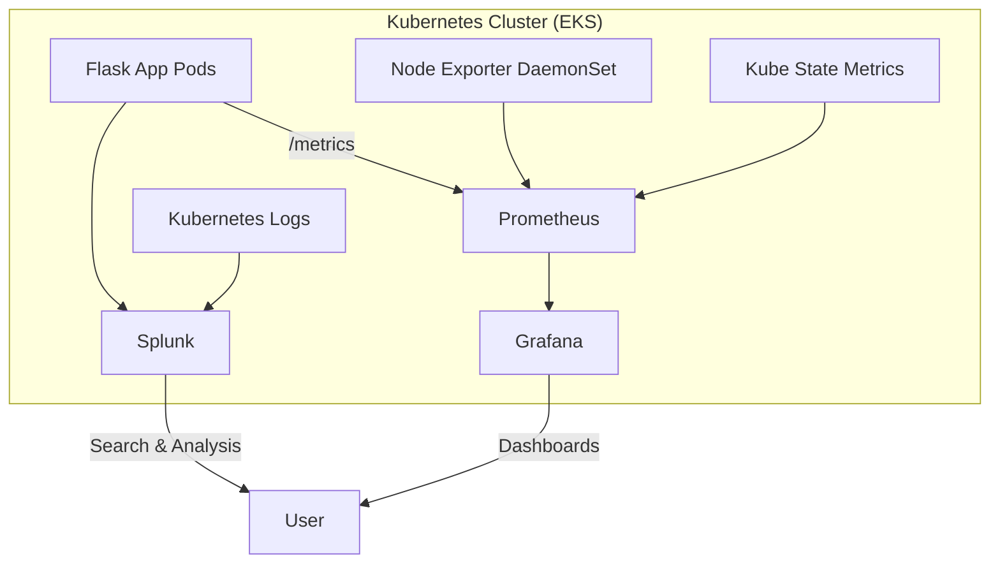

# Project 03 – Monitoring & Logging Stack (Prometheus + Grafana + Splunk)

## 📌 Overview  
In this project, we implement a **complete Monitoring & Logging Stack** on Kubernetes using:  
- **Prometheus** → Metrics collection and alerting  
- **Grafana** → Metrics visualization and dashboards  
- **Splunk** → Centralized log management and search  

The setup monitors both **Kubernetes system metrics (nodes, pods, cluster health)** and **application metrics (Flask app with Prometheus client)**, along with optional log forwarding into Splunk.  

This project demonstrates how to build a real-world observability stack for containerized applications.  

---

## ⚙️ Tools & Technologies  
- **Kubernetes (EKS on AWS)** – Container orchestration  
- **Prometheus** – Metrics collection  
- **Grafana** – Metrics visualization  
- **Splunk** – Log monitoring & search  
- **Node Exporter** – Node-level metrics  
- **Kube State Metrics** – Kubernetes object metrics  
- **Prometheus Python Client** – Flask app metrics  

---

## 🏗️ Project Workflow  


---

## 📂 Repository Structure  
```
03-monitoring-logging/
├── prometheus/
│   ├── prometheus-config.yaml
│   ├── deployment.yaml
│   ├── kube-state-metrics.yaml
│   ├── kube-state-metrics-rbac.yaml
│   ├── node-exporter.yaml
│   ├── prometheus-rbac.yaml
│   └── service.yaml
├── grafana/
│   ├── grafana-config.yaml
│   ├── deployment.yaml
│   └── service.yaml
├── splunk/
│   ├── splunk-config.yaml
│   ├── deployment.yaml
│   └── service.yaml
├── dashboards/
│   ├── system-metrics.json
│   ├── app-metrics.json
│   └── logging-dashboard.json
├── screenshots/
│   └── (to be added later)
└── README.md
```

---

## 🚀 Implementation Steps  

### 1️⃣ Deploy Flask App with Prometheus Metrics  
- Updated `app.py` with `/metrics` endpoint using `prometheus_client`  
- Built and pushed Docker image → `kesavan07/flask-cicd-app:latest`  
- Deployed with Blue/Green versions  

### 2️⃣ Deploy Prometheus  
- Created `prometheus-config.yaml` with scrape jobs for:  
  - Flask app annotations  
  - Node Exporter  
  - Kube State Metrics  
- Added RBAC via `prometheus-rbac.yaml`  

### 3️⃣ Deploy Node Exporter  
- `node-exporter.yaml` DaemonSet runs on each node to expose node metrics  

### 4️⃣ Deploy Kube State Metrics  
- Provides cluster state (pods, deployments, nodes, namespaces, etc.)  
- Configured RBAC with `kube-state-metrics-rbac.yaml`  

### 5️⃣ Deploy Grafana  
- Installed via `grafana.yaml`  
- Imported dashboards:  
  - `system-metrics.json` (Node metrics)  
  - `app-metrics.json` (Flask app metrics)  
  - Cluster dashboards from Kube State Metrics  

### 6️⃣ Deploy Splunk (Optional Logging)  
- Installed via `splunk.yaml` with persistent volume claim  
- Configured to ingest Flask app logs and Kubernetes pod logs (future extension)  

---

## 📊 Sample Dashboards  
- **System Metrics Dashboard** → CPU, memory, disk, network per node  
- **Application Metrics Dashboard** → Flask request counts, latency, error rate  
- **Cluster Health Dashboard** → Pods, deployments, namespaces (via kube-state-metrics)  
- **Logging Dashboard** → Kubernetes + Flask logs in Splunk  

---

## 📝 Next Steps  
- Automate dashboard import with Grafana sidecar  
- Add Splunk Connect for Kubernetes (to stream logs automatically)  
- Configure alerts in Prometheus and Grafana (e.g., high CPU, pod failures)  

---

✅ With this project, we now have a **production-ready Monitoring & Logging Stack** that covers **metrics + visualization + logs** for Kubernetes workloads.  
