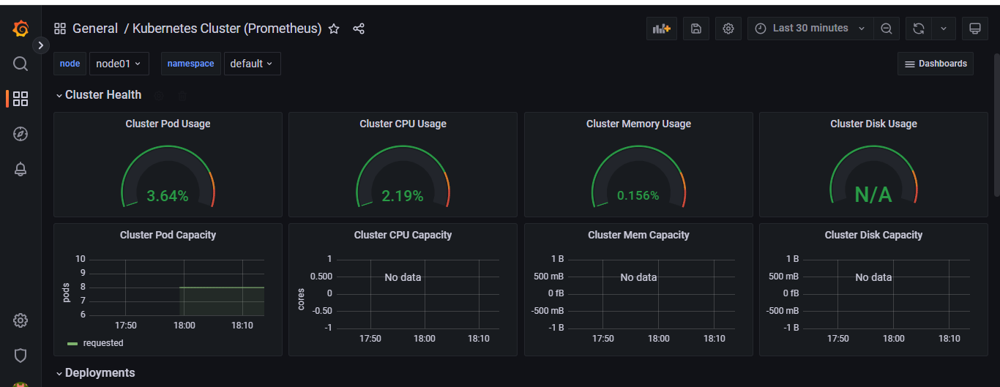

# 📸 Screenshots – Monitoring & Logging Stack (Prometheus + Grafana + Splunk)

This directory contains screenshots from **Project 03**, where we deployed a complete monitoring and logging stack on Kubernetes using **Prometheus, Grafana, and Splunk**.
These visuals demonstrate the successful setup of **metrics collection, visualization, and log management**.

---

## 🔹 Grafana Dashboards

### 1. Node Exporter Dashboard (ID: 1860)

Displays **system-level metrics** such as CPU, memory, disk usage, load, and uptime for Kubernetes nodes.

---

### 2. Kubernetes Cluster Dashboard (ID: 6417)

Shows **cluster-wide health** including pod usage, CPU usage, memory usage, and deployment stats.

---

## 🔹 Prometheus Queries

### 3. Prometheus – `up` Query

Validates that **Flask App, Node Exporter, Kube-State-Metrics, and Kubernetes Nodes/Pods** are being scraped successfully.

---

### 4. Prometheus – Node CPU Metrics

Displays CPU usage over time from **node-exporter**, confirming node-level metric collection.

---

### 5. Prometheus Targets

All scrape targets (`flask-app`, `kube-state-metrics`, `kubernetes-nodes`, `kubernetes-pods`, `node-exporter`) are **UP and healthy**.

---

## 🔹 Splunk – Log Management

### 6. Splunk Web UI

Shows **log ingestion and querying** in Splunk, verifying integration with Kubernetes pods and application logs.

---

## ✅ Summary

These screenshots validate that:

* Prometheus is successfully scraping **application, node, and cluster metrics**.
* Grafana is visualizing data using **imported dashboards (Node Exporter 1860, Kubernetes 6417)**.
* Splunk is collecting and indexing logs for **log analysis and monitoring**.

This completes the **Monitoring & Logging Stack (Project 03)** with **end-to-end observability** for Kubernetes workloads.
