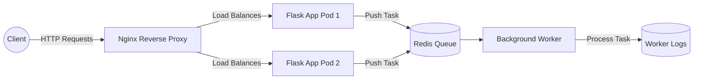

# Project 04 – Dockerized Microservices with Kubernetes & Nginx Reverse Proxy

This project demonstrates a **microservices architecture** built with **Flask, Redis, and a background Worker**, all orchestrated using **Docker Compose** and later scaled on **Kubernetes**. An **Nginx reverse proxy** exposes the services securely and balances requests across multiple replicas of the Flask app.

---

## 🚀 Features

* **Flask API Service**

  * REST API to add tasks (`/api/add`)
  * Test route for GET requests (`/add/<task>`)
  * Publishes tasks to Redis queue

* **Worker Service**

  * Consumes tasks from Redis using `BRPOP`
  * Logs "Processing task" and "Completed task"

* **Redis**

  * Acts as a message queue between Flask and Worker

* **Nginx Reverse Proxy**

  * Exposes only **one endpoint** (`nginx-service`)
  * Load balances requests across Flask replicas
  * Additional routes configured for API endpoints

* **Kubernetes Setup**

  * Deployments for Flask, Worker, Redis, and Nginx
  * ConfigMap for Nginx configuration
  * LoadBalancer/NodePort for external access
  * Scalable architecture (multiple Flask pods behind Nginx)

---

## 📂 Repository Structure

```
04-docker-microservices/
│
├── app/
│   ├── app.py
│   ├── requirements.txt
│   └── Dockerfile
│
├── worker/
│   ├── worker.py
│   ├── requirements.txt
│   └── Dockerfile
│
├── nginx/
│   └── nginx.conf
│
├── docker-compose.yaml
│
└── k8s-manifests/
    ├── flask-deployment.yaml
    ├── worker-deployment.yaml
    ├── redis.yaml
    ├── nginx-deployment.yaml
    └── nginx-config.yaml
```

---

## 🐳 Run with Docker Compose

```bash
# Start all services
docker-compose up --build

# Access Flask API through Nginx
curl -X POST http://localhost:8080/api/add/task1
```

---

## ☸️ Deploy on Kubernetes

```bash
# Apply all manifests
kubectl apply -f k8s-manifests/

# Verify pods
kubectl get pods

# Forward Nginx service
kubectl port-forward svc/nginx-service 8085:80
```

### Test API Endpoints

```bash
# Add a task via API
curl -X POST http://localhost:8085/api/add/task1

# Test GET endpoint
curl http://localhost:8085/add/task1
```

---

## 📊 Scaling

Scale Flask app replicas for load balancing:

```bash
kubectl scale deployment flask-app --replicas=3
kubectl get pods -l app=flask-app
```

Nginx will automatically distribute requests across replicas.

---

## 🔁 Request & Task Processing Flow with NGINX, Flask, Redis, and Worker



---

### 🔎 Explanation of Flow

1. **Client** → Sends requests to the single exposed endpoint (Nginx).
2. **Nginx Reverse Proxy** → Distributes traffic across multiple **Flask pods**.
3. **Flask App** → Accepts requests, pushes tasks into **Redis**.
4. **Redis Queue** → Stores pending tasks until a worker consumes them.
5. **Worker Service** → Pulls tasks using `BRPOP`, processes them, and logs the output.

---

