# Project 05 – Serverless AWS Lambda API (Terraform + CI/CD with GitHub Actions)

**🧠 Lambda + 🌐 API Gateway + 💾 DynamoDB**  
Infrastructure as Code with **⚙️ Terraform** · CI/CD via **🤖 GitHub Actions**

---

## 🧩 Overview

This project implements a small **Serverless REST API** using:

- **AWS Lambda** (Python) — business logic handler
- **API Gateway (HTTP API v2)** — exposes REST endpoints
- **DynamoDB** — NoSQL persistence for tasks
- **Terraform** — Infrastructure as Code (provision Lambda, API, IAM, DynamoDB)
- **GitHub Actions** — CI/CD pipeline (build package → terraform plan/apply; safe destroy workflow)

API surface:
- `POST /task` → create a task (body: `{"taskId": "...", "description":"..."}`)
- `GET /task/{id}` → fetch a task
- `DELETE /task/{id}` → delete a task

> **⚠️ Important:** Terraform uses a **local path** to `lambda_package.zip` when creating/updating the Lambda function. The GitHub Actions workflow and local instructions **build the ZIP before running `terraform plan` / `apply`**.

---

## 🧭 Sequence Diagram (Full CI/CD + Runtime Flow)

```mermaid
sequenceDiagram
    participant Dev as Developer
    participant GH as GitHub (repo)
    participant CI as GitHub Actions (workflow)
    participant S3 as S3 Backend (tfstate)
    participant TF as Terraform
    participant AWS as AWS Cloud
    participant User as End User

    Dev->>GH: Push code (lambda/, terraform/)
    GH->>CI: Trigger deploy workflow
    CI->>CI: Build lambda_package.zip (build.sh)
    CI->>S3: Use remote backend (state lock via DynamoDB)
    CI->>TF: terraform init/plan/apply (uses lambda_package.zip)
    TF->>AWS: Create/Update Lambda, API Gateway, DynamoDB, IAM roles
    User->>AWS: HTTP Request → API Gateway
    AWS->>AWS: Invoke Lambda
    AWS->>DynamoDB: Read/Write Task
    AWS->>User: API Response
```



---

## 🧰 Tech stack

- Terraform  
- AWS: Lambda, API Gateway (HTTP API v2), DynamoDB, IAM, S3 (remote backend)  
- GitHub Actions (OIDC role assumption recommended)  
- Python (Lambda handler)  
- Bash (`build.sh`)

---

## 📁 Repo layout (relevant paths)

```
devops-portfolio/
└── 05-serverless-aws/
    ├── lambda/
    │   ├── app.py            # Lambda handler (POST/GET/DELETE)
    │   └── requirements.txt  # Optional (boto3 available in Lambda runtime)
    ├── build.sh              # Creates lambda_package.zip
    ├── lambda_package.zip    # Generated artifact (gitignored)
    ├── terraform/
    │   ├── provider.tf
    │   ├── variables.tf
    │   ├── backend.tf        # S3 backend block (bucket/table are prerequisites)
    │   ├── dynamodb.tf
    │   ├── iam.tf
    │   ├── lambda.tf
    │   ├── apigateway.tf
    │   ├── outputs.tf
    │   └── terraform.tfvars
    └── README.md             # This file
.github/
└── workflows/
    ├── deploy.yml           # GitHub Actions deploy (build -> terraform plan/apply)
    └── terraform-destroy.yml# Safe destroy with typed confirmation (DESTROY)
```

> 📌 Note: GitHub Actions workflow files are placed under `.github/workflows/` at the repository root (not under `05-serverless-aws/`). The `build.sh` script is under `05-serverless-aws/`.

---

## 📋 Prerequisites

- An AWS account with permissions to create: Lambda, API Gateway, DynamoDB, IAM roles, S3 bucket, DynamoDB table for locks.  
- **Remote backend** (S3 bucket + DynamoDB lock table) **must exist** before running `terraform init`. The project expects you to create these manually (or use a provided bootstrap script if you add one later).  
- Terraform installed locally (same major version as CI).  
- AWS credentials locally (`aws configure`) for local runs OR a GitHub OIDC role for Actions.

---

## 🧑‍💻 Local workflow — build, plan, apply

> Make sure `lambda_package.zip` exists before running Terraform.

1. **📦 Build the Lambda package**

```bash
cd devops-portfolio/05-serverless-aws
chmod +x build.sh
./build.sh
# Creates lambda_package.zip at 05-serverless-aws/lambda_package.zip
```

2. **🔧 Initialize Terraform (first time will configure the remote backend)**

```bash
cd terraform
terraform init
terraform validate
```

3. **📋 Plan & apply**

```bash
terraform plan -var-file="terraform.tfvars" -out=tfplan
terraform apply -auto-approve tfplan
```

4. **🌐 Get API endpoint**

```bash
terraform output -raw api_endpoint
```

---

## 🚀 CI/CD with GitHub Actions (deploy)

- Workflow: `.github/workflows/deploy.yml`
- Behavior:
  1. Trigger: `workflow_dispatch` (manual) or optionally `push` to `main`.
  2. Builds `lambda_package.zip` (runs `05-serverless-aws/build.sh`).
  3. Assumes an IAM role via GitHub OIDC (recommended) to get AWS permissions.
  4. Runs `terraform init` (remote backend), `terraform plan -out=tfplan`, `terraform apply tfplan`.
  5. Prints `api_endpoint` output for easy testing.

> **⚠️ Important**: The build (packaging) step must run **before** `terraform plan`/`apply` because Lambda resource references the zip file.

---

## 💣 CI/CD: Safe destroy workflow (GitHub Actions)

- Workflow: `.github/workflows/terraform-destroy.yml`
- Trigger: `workflow_dispatch` with required input `confirm_destroy`.
- Workflow enforces typing the word `DESTROY` exactly to proceed.
- Workflow also ensures the `lambda_package.zip` artifact exists (build step runs) because Terraform references the file even on destroy.
- Only allowed from `main` branch (safety best practice).

---

## 🧪 Testing the API (after deploy)

Retrieve the API endpoint:

```bash
cd devops-portfolio/05-serverless-aws/terraform
terraform output -raw api_endpoint
# Example: https://<id>.execute-api.ap-south-1.amazonaws.com
```

Sample requests:

```bash
# Create
curl -X POST "${API}/task" \
  -H "Content-Type: application/json" \
  -d '{"taskId":"task1","description":"My first task"}'

# Read
curl "${API}/task/task1"

# Delete
curl -X DELETE "${API}/task/task1"
```

Check the DynamoDB table (AWS Console or CLI) to verify items were created.

---

## 📤 Outputs

Terraform outputs (example):

- `api_endpoint` — HTTP API base URL  
- `lambda_function_name` — Lambda function name  
- `dynamodb_table_name` — DynamoDB table name

---

## 🧯 Troubleshooting & Tips

- **`lambda_package.zip not found` during plan** — ensure you ran `./build.sh` and the path in `variables.tf` matches (defaults expect `../lambda_package.zip` relative to `terraform/`).
- **Backend init errors** — ensure the S3 bucket and DynamoDB lock table exist and the IAM role used by Actions has `s3:GetObject`, `s3:PutObject`, `s3:ListBucket`, and DynamoDB permissions.
- **Lambda errors at runtime** — check CloudWatch logs (Lambda's logs) to troubleshoot exceptions (note: CloudWatch is not created by Terraform in this project, Lambda writes logs automatically).
- **Permission denied / access errors** — verify the GitHub OIDC role's trust relationship and attached policies.

---

## 🛡️ Security & IAM notes

- Use **GitHub OIDC** for short-lived credentials in Actions. Create a minimal IAM role that:
  - Allows assume-role by GitHub Actions OIDC provider
  - Grants limited permissions for Terraform operations (S3 access to backend, DynamoDB lock table, Lambda, API Gateway, DynamoDB CRUD, IAM:PassRole for the Lambda execution role)
- The Lambda execution role gives the function permission to read/write the specific DynamoDB table and to write CloudWatch logs (via `AWSLambdaBasicExecutionRole`).


